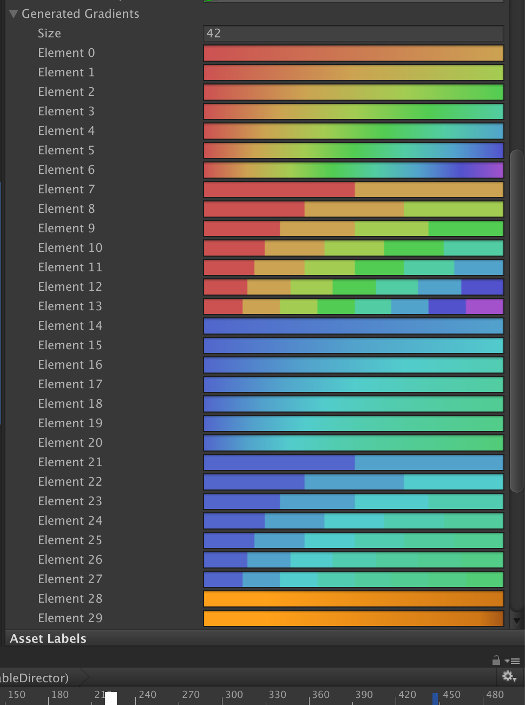
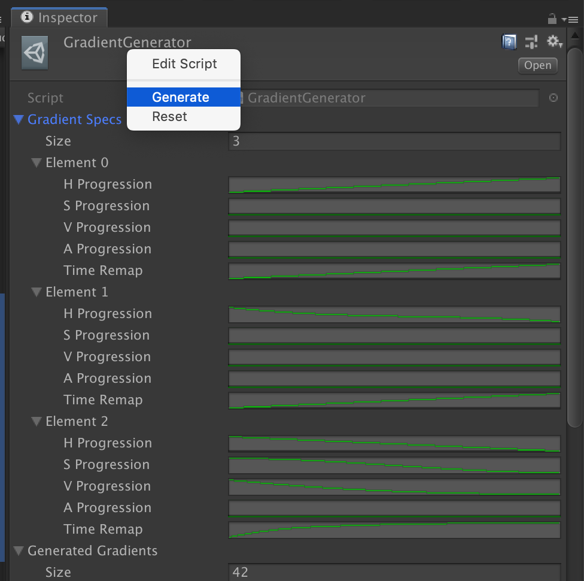
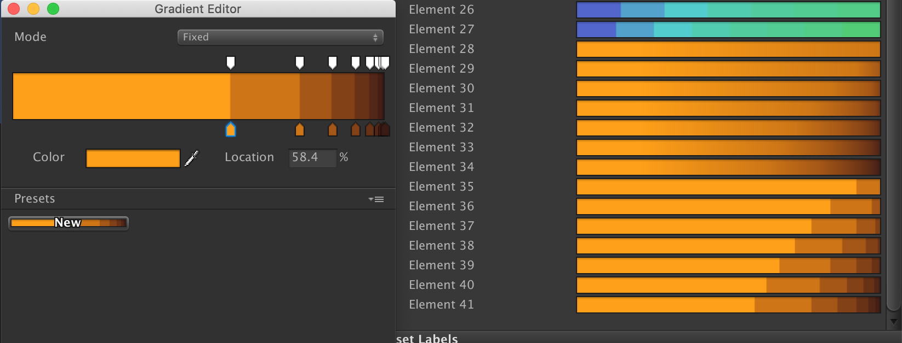

# Gradient Generator

A Unity script to generate multiple variants of evenly distributed `Gradient` based on input `AnimationCurve` of HSV and alpha. Skew the distribution with `timeRemap` `AnimationCurve`.

The generated gradients can be copied by the right click menu, then you could fine tune the color. You can keep the generated gradient in the generator since it is a `ScriptableObject` file.

## How to use

- Click on the `GradientGenerator` scriptable object file. If you lose it, uncomment `[CreateAssetMenu]`, then right click create a new one.
- Provide `AnimationCurve` in the `gradientSpecs`. All curve values has to be in 0 to 1 range. To get a simple rainbow, use 0 to 1 "／" curve preset for Hue and `timeRemap`, then use a constant graph for S and V.
- Right click the header and select `Generate` context menu.

`generatedGradients` will be replaced with a new set. Each spec generates 7 `Blend` and 7 `Fixed` type of gradients.

An example when using the `timeRemap` curve, the distribution could be skewed.

